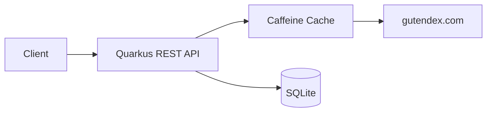

# Book Rating System

REST API that wraps [Gutendex](https://gutendex.com/) (a public domain book catalog) and lets users rate and review books. Built with Quarkus + SQLite.

## Requirements

- Java 21
- Maven 3.9+ (or use the included `mvnw` wrapper)
- Docker (optional, for containerized run)

## Running

```bash
# dev mode with hot reload
./mvnw quarkus:dev

# production build + run
./mvnw package -DskipTests
java -jar target/quarkus-app/quarkus-run.jar

# Docker
docker compose up --build
```

The app starts on `http://localhost:8080`. Swagger UI available at `/q/swagger-ui` in dev mode.

## Running tests

```bash
./mvnw verify
```

Tests use a mock Gutendex client (no network calls). SQLite DB is created/destroyed per test run.

## API

### Search books

```bash
curl "http://localhost:8080/api/books?title=frankenstein"
curl "http://localhost:8080/api/books?title=shakespeare&page=2"
```

Returns paginated results from Gutendex. The `page` param maps directly to Gutendex's pagination (32 results per page).

### Get book details

```bash
curl http://localhost:8080/api/books/84
```

Combines Gutendex metadata with locally stored reviews. Returns average rating and review texts.

### Submit a review

```bash
curl -X POST http://localhost:8080/api/books/84/reviews \
  -H "Content-Type: application/json" \
  -d '{"rating": 4, "review": "Genuinely creepy, holds up surprisingly well"}'
```

Rating must be 0-5 (integer). Review text is required, max 5000 chars. The book must exist on Gutendex.

### List reviews (paginated)

```bash
curl "http://localhost:8080/api/books/84/reviews?page=1&size=10"
```

Note: this endpoint is not in the original spec. Added as a convenience for paginated access to a book's reviews (the details endpoint returns all reviews unpaginated).

### Top rated books

```bash
curl "http://localhost:8080/api/books/top?limit=5"
```

Returns books ranked by average rating. Only books with at least one review appear. Limit defaults to 10, max 100.

### Monthly rating breakdown

```bash
curl http://localhost:8080/api/books/84/ratings/monthly
```

Returns average rating per month for a book, sorted newest first.

### Error responses

All errors return JSON:
```json
{"status": 404, "message": "Book 99999 not found"}
```

Validation errors include details:
```json
{"status": 400, "message": "Validation failed", "errors": ["createReview.request.rating: Rating must be between 0 and 5"]}
```

If Gutendex is down, endpoints that depend on it return 503.

## Architecture

```
com.bookrating/
  resources/       REST endpoints (thin HTTP layer)
  service/         Business logic + orchestration
    dto/           Request/response models
  domain/          Entity + repository
    repository/
  gateway/         External API clients
    gutendex/
  utils/
    exceptions/    Global error handling
```



### Caching

Gutendex responses are cached in-memory (Caffeine):
- Single book lookups: 15 minutes
- Search results: 5 minutes

### Fault tolerance

The Gutendex client has `@Retry(maxRetries=2, delay=500ms)` and `@Timeout(5s)` via MicroProfile Fault Tolerance.

## Configuration

Key properties in `application.properties`:

| Property | Default | Description |
|----------|---------|-------------|
| `quarkus.http.port` | 8080 | Server port |
| `quarkus.datasource.jdbc.url` | `jdbc:sqlite:bookrating.db` | SQLite file path |
| `quarkus.datasource.jdbc.max-size` | 1 | SQLite is single-writer |
| `quarkus.cache.caffeine."gutendex-book".expire-after-write` | 15M | Book cache TTL |
| `quarkus.cache.caffeine."gutendex-search".expire-after-write` | 5M | Search cache TTL |

Override via environment variables: `QUARKUS_DATASOURCE_JDBC_URL=jdbc:sqlite:/data/my.db`

## Design Decisions

**Why Quarkus?** Fast startup, built-in REST client with fault tolerance annotations, dev mode with hot reload. Felt like the right fit for a small focused API without the ceremony of Spring Boot.

**Why SQLite?** Zero infrastructure to run. No need to install or configure a database server, the reviewer can `./mvnw quarkus:dev` and it just works. For production or concurrent writes I'd switch to Postgres.

**Why in-memory cache instead of Redis?** Same reasoning: no external dependencies to start. Caffeine gives us what we need (TTL-based eviction) without extra setup.

**Monthly ratings computed in Java, not SQL?** SQLite's date functions aren't accessible through Hibernate's query abstraction in a portable way. With Postgres I'd use `date_trunc` in a native query. For the expected data volume here it's fine.

**Architecture (resource/service/domain/gateway)?** Clear separation of concerns without over-abstracting. Resources handle HTTP, services hold business logic, domain owns persistence, gateway wraps external calls. Each layer has a single responsibility.

## Stack

- Java 21, Quarkus 3.37
- Hibernate ORM + Panache (SQLite)
- MicroProfile REST Client + Fault Tolerance
- Caffeine cache
- Bean Validation
- Lombok
- Docker (multi-stage build, Alpine JRE)
