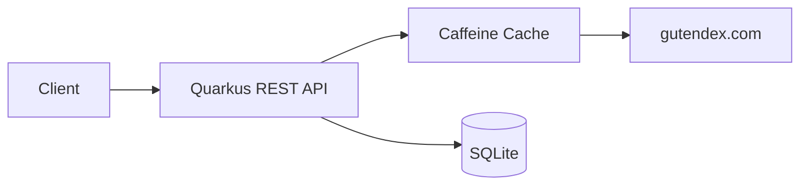

# Book Rating System

REST API that wraps the [Gutendex](https://gutendex.com/) public domain book catalog and lets users rate and review books. Built with Quarkus + SQLite.

## Running it

```bash
# dev mode (hot reload)
./mvnw quarkus:dev

# or with Docker
docker compose up --build
```

Tests: `./mvnw test`

## Endpoints

| Method | Path | What it does |
|--------|------|--------------|
| GET | `/api/books?title=frankenstein&page=1` | Search books (proxied from Gutendex) |
| GET | `/api/books/84` | Book details + aggregated reviews |
| GET | `/api/books/top?limit=10` | Top rated books |
| POST | `/api/books/84/reviews` | Submit a review |
| GET | `/api/books/84/reviews` | List reviews for a book |
| GET | `/api/books/84/ratings/monthly` | Average rating by month |

Swagger UI is at `/q/swagger-ui` in dev mode.

### Review payload

```json
{"rating": 4, "review": "Genuinely creepy, holds up surprisingly well"}
```

Rating must be 0-5, review text required.

## Architecture



The Gutendex responses are cached (15 min for single books, 5 min for search results) to avoid hammering the upstream API.

## Stack

- Java 21, Quarkus 3.37
- Hibernate ORM + Panache (SQLite)
- MicroProfile REST Client
- Caffeine cache
- Bean Validation
- Docker (multi-stage build)
